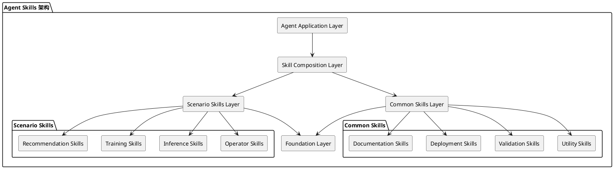

# Agent-Skills 代码仓设计文档

## 1. 项目概述

### 1.1 项目定位
agent-skills 是昇腾（Ascend）社区用于AI辅助研发的核心管理仓库，专注于AI Agent技能的开发和管理，促进AI Agent技能的协同开发和创新。

### 1.2 核心目标
- 场景化关联引用Ascend社区各场景化skill能力
- 通用能力共建，为内外部开发者提供Agent skills
- 围绕算子、推理、训练、推荐等场景建立场景化skill能力
- 建立Ascend社区通用的skill能力
- 促进技能的协同开发、共享和创新

### 1.3 目标用户
- 昇腾社区开发者
- 场景化应用开发者
- 内外部合作伙伴

## 2. 项目架构设计

### 2.1 整体架构
```
agent-skills/
├── skills/`                    # 技能核心目录
│   ├── scenarios/            # 场景化技能
│   │   ├── operators/        # 算子场景技能
│   │   ├── inference/        # 推理场景技能
│   │   ├── training/         # 训练场景技能
│  `│   ├── recommendation/   # 推荐场景技能
│   │   └── custom/           # 自定义场景技能
│   └── common/               # 通用技能
│       ├── utils/            # 工具类技能
│       ├── validators/       # 验证类技能
│       ├── deployment/       # 部署类技能
│       └── docs/             # 文档类技能
├── docs/                     # 文档目录
│   ├── design/               # 设计文档
│   ├── guides/               # 开发指南
│   └── examples/             # 示例文档
├── tests/                    # 测试目录
│   ├── test-data/          # 测试数据集
│   ├── validators/         # 验证脚本
│   └── expected-results/   # 预期结果
├── scripts/                  # 脚本工具
│   └── validate_skills.py    # 技能验证脚本
├── template/                 # 技能模板
│   └── SKILL.md             # 标准技能模板
├── README.md                 # 项目说明文档
└── .gitignore               # Git 忽略配置
```

### 2.2 技能层次架构



## 3. 技能标准化设计

### 3.1 Agent Skills 标准
本项目遵循 [Agent Skills](https://agentskills.io) 标准，确保技能的互操作性和跨平台兼容性。

### 3.2 技能目录结构
每个技能采用扁平化、自包含的结构设计：

`|`
```
skill-name/
├── SKILL.md              # 技能定义文件（必需）
├── README.md             # 技能说明文档（可选）
├── references/           # 参考文档（可选）
│   ├── commands.md      # 命令参考
│   └── examples.md      # 使用示例
├── scripts/              # 辅助脚本（可选）
└── resources/            # 资源文件（可选）
```

### 3.3 SKILL.md 规范
每个技能必须包含 SKILL.md 文件，使用 YAML frontmatter 和 Markdown 内容：

```markdown
---
name: skill-name
description: 技能的详细描述，说明技能的功能和使用场景
category: scenario|common
subcategory: operators|inference|training|recommendation|utils|validators|deployment|docs
version: 1.0.0
author: 作者信息
tags: [tag1, tag2]
---

# 技能标题

## 技能描述
详细描述技能的功能、用途和适用场景

## 使用场景
- 场景1：描述
- 场景2：描述

## 核心功能
- 功能1：描述
- 功能2：描述

## 快速参考
| 任务 | 命令/方法 |
|------|----------|
| 任务1 | command1 |
| 任务2 | command2 |

## 使用示例
```bash
# 示例1
command example

# 示例2
another example
```

## 最佳实践
- 最佳实践1
- 最佳实践2

## 注意事项
- 注意事项1
- 注意事项2

## 相关资源
- [文档链接](url)
- [示例代码](url)
```

## 4. 技能发现机制

### 4.1 标准技能发现路径
按照以下优先级搜索技能：

```
优先级搜索路径：
1. skills/
2. .agents/skills/
3. .opencode/skills/
```

### 4.2 插件清单发现（可选）
如果 `.agents-plugin/marketplace.json` 存在，也会发现其中声明的技能：

```json
{
  "metadata": { "pluginRoot": "./plugins" },
  "plugins": [
    {
      "name": "my-plugin",
      "source": "my-plugin",
      "skills": ["./skills/review", "./skills/test"]
    }
  ]
}
```

## 5. 技能组织架构

### 5.1 技能分类体系
```
Agent Skills
├── 场景化技能 (Scenario Skills)
│   ├── 算子技能 (Operator Skills)
│   ├── 推理技能 (Inference Skills)
│   ├── 训练技能 (Training Skills)
│   └── 推荐技能 (Recommendation Skills)
└── 通用技能 (Common Skills)
    ├── 工具技能 (Utility Skills)
    ├── 验证技能 (Validation Skills)
    ├── 部署技能 (Deployment Skills)
    └── 文档技能 (Documentation Skills)
```

## 6. 技能安装方式

### 6.1 CLI 安装（推荐）
使用 CLI 工具安装技能：

```bash
# 安装所有技能到当前项目
npx ascend-skills add

# 安装特定技能
npx ascend-skills add --skill operator-dev

# 安装到全局
npx ascend-skills add --global
```

### 6.2 手动安装
用户可以直接复制技能到目标平台：

```bash
# 复制到 OpenCode 项目
cp -r skills/scenarios/operators/* .agents/skills/

# 复制到 OpenClaw 项目
cp -r skills/scenarios/operators/* skills/
```

## 7. 多平台兼容性设计

### 7.1 支持的平台（第一版）
- **OpenCode** - 主要支持平台
- **OpenClaw** - 主要支持平台
- **CodeBuddy** - 主要支持平台

### 7.2 平台配置
```typescript
interface AgentConfig {
  name: string;
  displayName: string;
  projectPath: string;
  globalPath: string;
  detectInstalled: () => Promise<boolean>;
}
```

### 7.3 主要平台详情

#### OpenCode
- **项目路径**：`.agents/skills/`
- **全局路径**：`~/.config/opencode/skills/`
- **检测方式**：检查 `~/.config/opencode` 目录

#### OpenClaw
- **项目路径**：`skills/`
- **全局路径**：`~/.openclaw/skills/`
- **检测方式**：检查 `~/.openclaw` 目录

#### CodeBuddy
- **项目路径**：`.codebuddy/skills/`
- **全局路径**：`~/.codebuddy/skills/`
- **检测方式**：检查 `~/.codebuddy` 目录

## 8. 测试数据集设计
> 预留，后续增量设计

## 9. CLI 工具设计

### 9.1 CLI 工具架构

#### 9.1.1 技术栈选择
- **运行时**：Node.js >= 18
- **包管理器**：pnpm
- **语言**：TypeScript
- **构建工具**：esbuild/obuild
- **测试框架**：vitest

#### 9.1.2 目录结构
```
agent-skills/
├── bin/
│   └── cli.mjs                 # CLI 入口文件
├── src/
│   ├── cli.ts                  # CLI 主逻辑
│   ├── commands/
│   │   ├── add.ts              # 添加技能命令
│   │   ├── list.ts             # 列出技能命令
│   │   └── remove.ts           # 删除技能命令
│   ├── core/
│   │   ├── agents.ts           # 代理配置
│   │   ├── skills.ts           # 技能发现和解析
│   │   └── installer.ts        # 安装逻辑
│   ├── utils/
│   │   ├── logger.ts           # 日志工具
│   │   └── validation.ts       # 验证工具
│   └── types.ts                # TypeScript 类型定义
├── scripts/
│   └── validate_skills.py      # 技能验证脚本
├── package.json
├── tsconfig.json
└── build.config.mjs
```

#### 9.1.3 package.json 配置
```json
{
  "name": "ascend-skills",
  "version": "1.0.0",
  "description": "Ascend Community Agent Skills CLI",
  "type": "module",
  "bin": {
    "ascend-skills": "./bin/cli.mjs"
  },
  "scripts": {
    "build": "obuild",
    "dev": "node src/cli.ts",
    "test": "vitest",
    "type-check": "tsc --noEmit",
    "format": "prettier --write 'src/**/*.ts'"
  },
  "engines": {
    "node": ">=18"
  },
  "packageManager": "pnpm@10.17.1"
}
```

### 9.2 CLI 命令设计（第一版）

#### 9.2.1 add 命令
```bash
# 安装所有技能到当前项目
npx ascend-skills add

# 安装特定技能
npx ascend-skills add --skill operator-dev

# 安装到全局
npx ascend-skills add --global

# 安装到特定代理
npx ascend-skills add --agent opencode

# 列出可用技能
npx ascend-skills add --list
```

**选项说明**：
| 选项 | 描述 |
|------|------|
| `-g, --global` | 安装到用户目录而非项目目录 |
| `-a, --agent <agent>` | 目标代理（如 opencode、openclaw） |
| `-s, --skill <skill>` | 安装特定技能 |
| `-l, --list` | 列出可用技能而不安装 |

#### 9.2.2 list 命令
```bash
# 列出所有已安装技能
npx ascend-skills list

# 仅列出全局技能
npx ascend-skills list --global

# 按代理过滤
npx ascend-skills list --agent opencode
```

#### 9.2.3 remove 命令
```bash
# 删除特定技能
npx ascend-skills remove operator-dev

# 从全局删除
npx ascend-skills remove --global operator-dev

# 从特定代理删除
npx ascend-skills remove --agent opencode operator-dev
```

### 9.3 核心模块设计

#### 9.3.1 代理配置 (agents.ts)
```typescript
interface AgentConfig {
  name: string;
  displayName: string;
  projectPath: string;
  globalPath: string;
  detectInstalled: () => Promise<boolean>;
}

const AGENTS: AgentConfig[] = [
  {
    name: 'opencode',
    displayName: 'OpenCode',
    projectPath: '.agents/skills/',
    globalPath: '~/.config/opencode/skills/',
    detectInstalled: async () => {
      const home = process.env.HOME || process.env.USERPROFILE;
      return existsSync(`${home}/.config/opencode`);
    }
  },
  {
    name: 'openclaw',
    displayName: 'OpenClaw',
    projectPath: 'skills/',
    globalPath: '~/.openclaw/skills/',
    detectInstalled: async () => {
      const home = process.env.HOME || process.env.USERPROFILE;
      return existsSync(`${home}/.openclaw`);
    }
  },
  {
    name: 'codebuddy',
    displayName: 'CodeBuddy',
    projectPath: '.codebuddy/skills/',
    globalPath: '~/.codebuddy/skills/',
    detectInstalled: async () => {
      const home = process.env.HOME || process.env.USERPROFILE;
      return existsSync(`${home}/.codebuddy`);
    }
  }
];
```

#### 9.3.2 技能发现 (skills.ts)
```typescript
interface SkillMetadata {
  name: string;
  description: string;
  category?: string;
  subcategory?: string;
  version?: string;
  author?: string;
  tags?: string[];
}

'```typescript
class SkillDiscovery {
  private readonly searchPaths = [
    'skills/',
    '.agents/skills/',
    '.opencode/skills/'
  ];

  async discover(repoPath: string): Promise<SkillMetadata[]> {
    const skills: SkillMetadata[] = [];
    
    for (const searchPath of this.searchPaths) {
      const fullPath = join(repoPath, searchPath);
      if (existsSync(fullPath)) {
        const found = await this.searchInDirectory(fullPath);
        skills.push(...found);
      }
    }
    
    return skills;
  }

  private async searchInDirectory(dir: string): Promise<SkillMetadata[]> {
    const skills: SkillMetadata[] = [];
    const entries = await readdir(dir, { withFileTypes: true });
    
    for (const entry of entries) {
      if (entry.isDirectory()) {
        const skillPath = join(dir, entry.name);
        const skillMd = join(skillPath, 'SKILL.md');
        
        if (existsSync(skillMd)) {
          const metadata = await this.parseSkillMetadata(skillMd);
          if (metadata) {
            skills.push(metadata);
          }
        }
      }
    }
    
    return skills;
  }

  private async parseSkillMetadata(filePath: string): Promise<SkillMetadata | null> {
    const content = await readFile(filePath, 'utf-8');
    const frontmatter = this.extractFrontmatter(content);
    
    if (!frontmatter.name || !frontmatter.description) {
      return null;
    }
    
    return frontmatter as SkillMetadata;
  }

  private extractFrontmatter(content: string): any {
    const match = content.match(/^---\s*\n(.*?)\n---\s*/s);
    if (!match) return {};
    
    const data: any = {};
    const lines = match[1].split('\n');
    
    for (const line of lines) {
      const [key, ...valueParts] = line.split(':');
      if (key && valueParts.length > 0) {
        const value = valueParts.join(':').trim();
        data[key.trim()] = value;
      }
    }
    
    return data;
  }
}
```

#### 9.3.3 安装逻辑 (installer.ts)
```typescript
interface InstallOptions {
  global?: boolean;
  agent?: string;
  skill?: string;
}

class SkillInstaller {
  constructor(
    private agents: AgentConfig[],
    private discovery: SkillDiscovery
  ) {}

  async install(options: InstallOptions): Promise<void> {
    const repoPath = process.cwd();
    
    const availableSkills = await this.discovery.discover(repoPath);
    const skillsToInstall = this.selectSkills(availableSkills, options);
    const targetAgent = this.selectAgent(options);
    
    for (const skill of skillsToInstall) {
      await this.installSkill(skill, targetAgent, options);
    }
  }

  private async installSkill(
    skill: SkillMetadata,
    agent: AgentConfig,
    options: InstallOptions
  ): Promise<void> {
    const basePath = options.global ? agent.globalPath : agent.projectPath;
    const targetPath = join(basePath, skill.name);
    
    await copyDirectory(skill.path, targetPath);
    
    console.log(`✓ Installed ${skill.name} to ${agent.displayName}`);
  }
}
```

### 9.4 技能验证脚本

#### 9.4.1 Python 验证脚本
`scripts/validate_skills.py` - 验证技能结构和内容：

```python
#!/usr/bin/env python3
"""
Validate skill structure and content
"""

import re
import sys
from pathlib import Path

def parse_frontmatter(text):
    """Parse YAML frontmatter from SKILL.md"""
    match = re.search(r"^---\s*\n(.*?)\n---\s*", text, re.DOTALL)
    if not match:
        return {}
    data = {}
    for line in match.group(1).splitlines():
        if ":" in line:
            key, value = line.split(":", 1)
            data[key.strip()] = value.strip()
    return data

def validate_skill(skill_path):
    """Validate a single skill"""
    skill_md = skill_path / "SKILL.md"
    if not skill_md.exists():
        return False, "SKILL.md not found"
    
    content = skill_md.read_text()
    meta = parse_frontmatter(content)
    
    required_fields = ["name", "description"]
    for field in required_fields:
        if field not in meta:
            return False, f"Missing required field: {field}"
    
    return True, "Valid"

def main():
    """Validate all skills"""
    skills_dir = Path("skills")
    if not skills_dir.exists():
        print("No skills directory found")
        return 0
    
    total = 0
    valid = 0
    
    for skill_dir in skills_dir.glob("*/"):
        total += 1
        is_valid, message = validate_skill(skill_dir)
        status = "✓" if is_valid else "✗"
        print(f"{status} {skill_dir.name}: {message}")
        if is_valid:
            valid += 1
    
    print(f"\nTotal: {total}, Valid: {valid}, Invalid: {total - valid}")
    return 0 if valid == total else 1

if __name__ == "__main__":
    sys.exit(main())
```

#### 9.4.2 使用方式
```bash
# 验证所有技能
python scripts/validate_skills.py
```

## 10. 技能开发规范

### 10.1 命名规范
- 技能名称：小写字母，使用连字符分隔（如 ``operator-dev`）
- 目录名称：与技能名称一致
- 文件名称：小写字母，使用连字符分隔

### 10.2 SKILL.md 编写规范
- 使用清晰的 YAML frontmatter
- 提供详细的描述和使用场景
- 包含实用的示例和最佳实践
- 添加相关资源链接

### 10.3 代码规范
- 遵循相应语言的代码规范
- 添加必要的类型注解
- 编写清晰的文档字符串
- 保持函数单一职责

## 11. 协作流程

### 11.1 技能贡献流程
1. Fork 仓库
2. 创建特性分支
3. 复制模板创建新技能
4. 编写 SKILL.md 和相关资源
5. 运行验证验证脚本
6. 提交 Pull Request
7. 代码审核
8. 合并到主分支

### 11.2 代码审核标准
- SKILL.md 格式正确
- 技能描述清晰准确
- 示例代码可执行
- 通过自动化验证
- 文档完整准确

### 11.3 版本管理
- 遵循语义化版本规范
- 在 SKILL.md frontmatter 中标注版本
- 维护变更日志

## 12. 质量保障

### 12.1 自动化验证
- SKILL.md 格式验证
- YAML frontmatter 验证
- 技能结构验证
- 技能路径验证

### 12.2 文档质量
- 技能描述完整性
- 示例代码可执行性
- 文档格式一致性

## 13. 功能范围

### 13.1 包含功能
- 基本技能发现机制
- CLI 安装技能（add 命令）
- CLI 列出技能（list 命令）
- CLI 删除技能（remove 命令）
- 技能验证脚本
- 支持三个主要代理：OpenCode、OpenClaw、CodeBuddy

### 13.2 不包含功能（后续版本）
- 从外部仓库安装技能
- 更新技能（update 命令）
- 检查更新（check 命令）
- 查找技能（find 命令）
- 初始化技能模板（init 命令）
- 插件市场配置
- 遥测功能
- 测试数据集

### 13.3 设计原则
1. **简单优先**：第一版只实现核心功能
2. **渐进增强**：后续版本逐步添加高级功能
3. **易于使用**：提供清晰的命令和文档
4. **可扩展性**：架构设计支持后续功能扩展
