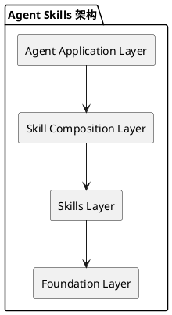

# Agent-Skills 代码仓设计文档

## 1. 项目概述

### 1.1 项目定位
agent-skills 是昇腾（Ascend）社区用于AI辅助研发的核心管理仓库，专注于AI Agent技能的开发和管理，促进AI Agent技能的协同开发和创新。

### 1.2 核心目标
- 为内外部开发者提供 Agent skills
- 建立Ascend社区通用的skill能力
- 促进技能的协同开发、共享和创新

### 1.3 目标用户
- 昇腾社区开发者
- 场景化应用开发者
- 内外部合作伙伴

## 2. 项目架构设计

### 2.1 整体架构
```
agent-skills/
├── skills/                    # 技能核心目录（扁平化结构）
│   ├── skill-name-1/         # 技能1
│   ├── skill-name-2/         # 技能2
│   └──── skill-name-n/       # 技能n
├── docs/                     # 文档目录
│   ├── design/               # 设计文档
│   ├── guides/               # 开发指南
│   └── examples/             # 示例文档
├── tests/                    # 测试目录
│   ├── test-data/          # 测试数据集
│   ├── validators/         # 验证脚本
│   └── expected-results/   # 预期结果
├── scripts/                  # 脚本工具
│   └── validate/validate_skills.py    # 技能验证脚本
├── template/                 # 技能模板
│   └── SKILL.md             # 标准技能模板
├── README.md                 #   项目说明文档
└── .gitignore               # Git 忽略配置
└── AGENTS.md               # AI编程助手指南
```

### 2.2 技能层次架构




## 3. 技能标准化设计

### 3.1 Agent Skills 标准
本项目遵循 [Agent Skills](https://agentskills.io) 标准，确保技能的互操作性和跨平台兼容性。

### 3.2 技能目录结构
每个技能采用扁平化、自包含的结构设计：

`|`
```
skill-name/
├── SKILL.md              # 技能定义文件（必需）
├── README.md             # 技能说明文档（可选）
├── references/           # 参考文档（可选）
│   ├── commands.md      # 命令参考
│   └── examples.md      # 使用示例
├── scripts/              # 辅助脚本（可选）
└── resources/            # 资源文件（可选）
```

### 3.3 SKILL.md 规范
每个技能必须包含 SKILL.md 文件，使用 YAML frontmatter 和 Markdown 内容：

```markdown
---
name: skill-name
description: 技能的详细描述，说明技能的功能和使用场景
---
