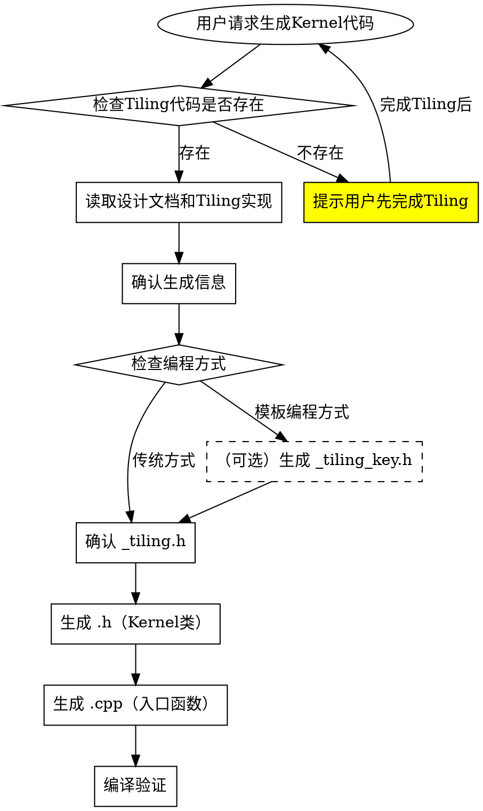

# AscendC 算子 Kernel 代码生成

根据算子设计文档和Tiling策略生成AI Core Kernel代码。

## 前置条件

1. 已完成算子设计（`ascendc-operator-design`）
2. 已完成Tiling代码生成（`ascendc-operator-tiling-code-gen`）
3. Tiling数据结构已定义（`<op_name>_tiling.h`）

## 工作流程



## 步骤1：确认设计信息

**从设计文档和Tiling实现提取**：

```
=== Kernel生成信息确认 ===
算子名称: <op_name>
数据类型: float, half
编程方式: 传统TilingKey / 模板编程
输入数量: 2
输出数量: 1
计算模式: 元素级加法

UB缓冲区规划:
  - inQueueX: 2块（双缓冲）
  - inQueueY: 2块（双缓冲）
  - outQueueZ: 2块（双缓冲）

确认生成？[Y/n]
```

## 步骤2：确认 \_tiling.h（Tiling数据结构）

**文件路径**：`op_host/<op_name>_tiling.h`

**此文件由Tiling代码生成步骤产生，Kernel侧只需确认字段一致。**

### TilingData结构示例

```cpp
#ifndef __<OP_NAME>_TILING_H__
#define __<OP_NAME>_TILING_H__

#include "register/tilingdata_base.h"

namespace optiling {
BEGIN_TILING_DATA_DEF(<OpName>TilingData)
    TILING_DATA_FIELD_DEF(uint32_t, totalLength);  // 总计算数据量
    TILING_DATA_FIELD_DEF(uint32_t, tileNum);      // 每个核上总计算数据分块个数
    TILING_DATA_FIELD_DEF(uint32_t, ubFactor);     // 核内切分因子
END_TILING_DATA_DEF;

REGISTER_TILING_DATA_CLASS(<OpName>, <OpName>TilingData)
} // namespace optiling

#endif // __<OP_NAME>_TILING_H__
```

**Kernel侧获取TilingData**：

```cpp
extern "C" __global__ __aicore__ void <op_name>(GM_ADDR x, GM_ADDR y, GM_ADDR z,
                                                  GM_ADDR workspace, GM_ADDR tiling)
{
    GET_TILING_DATA(tilingData, tiling);

    // 使用tilingData字段
    uint32_t totalLength = tilingData.totalLength;
    uint32_t tileNum = tilingData.tileNum;
}
```

**确保与Tiling实现一致**：此文件由Tiling代码生成，Kernel使用时需要确保字段一致。

## 步骤3：生成 .h（Kernel类定义）

**文件路径**：`op_kernel/<op_name>.h`

```cpp
/**
 * Copyright (c) 2025 Huawei Technologies Co., Ltd.
 * ...
 */

#ifndef __<OP_NAME>_H__
#define __<OP_NAME>_H__

#include "kernel_operator.h"
#include "kernel_tiling/kernel_tiling.h"

namespace Ns<OpName> {

using namespace AscendC;

constexpr int32_t BUFFER_NUM = 2;  // 双缓冲

template <typename T>
class <OpName> {
public:
    __aicore__ inline <OpName>(){};

    __aicore__ inline void Init(GM_ADDR x, GM_ADDR y, GM_ADDR z,
                                const <OpName>TilingData* tilingData);
    __aicore__ inline void Process();

private:
    __aicore__ inline void CopyIn(int64_t loopIdx);
    __aicore__ inline void Compute(int64_t loopIdx);
    __aicore__ inline void CopyOut(int64_t loopIdx);

private:
    // === 管道和队列 ===
    TPipe pipe;
    TQue<QuePosition::VECIN, BUFFER_NUM> inQueueX;
    TQue<QuePosition::VECIN, BUFFER_NUM> inQueueY;
    TQue<QuePosition::VECOUT, BUFFER_NUM> outQueueZ;

    // === 全局内存 ===
    GlobalTensor<T> xGm;
    GlobalTensor<T> yGm;
    GlobalTensor<T> zGm;

    // === Tiling参数 ===
    int64_t blockLength = 0;  // 当前核处理的总元素数
    int64_t tileNum = 0;      // 循环次数
    int64_t tileLength = 0;   // 每次循环处理的元素数
    int64_t lastTileLength = 0; // 最后一次循环处理的元素数
};

// ==================== 实现部分 ====================

template <typename T>
__aicore__ inline void <OpName><T>::Init(GM_ADDR x, GM_ADDR y, GM_ADDR z,
                                         const <OpName>TilingData* tilingData)
{
    uint32_t formerNum = tilingData->formerNum;
    uint32_t formerLength = tilingData->formerLength;
    uint32_t tailLength = tilingData->tailLength;
    uint32_t blockIdx = GetBlockIdx();

    if (blockIdx < formerNum) {
        // 整核：前 formerNum 个核
        this->blockLength = formerLength;
        xGm.SetGlobalBuffer((__gm__ T*)x + formerLength * blockIdx, formerLength);
        yGm.SetGlobalBuffer((__gm__ T*)y + formerLength * blockIdx, formerLength);
        zGm.SetGlobalBuffer((__gm__ T*)z + formerLength * blockIdx, formerLength);
    } else {
        // 尾核：后面的核
        this->blockLength = tailLength;
        // 尾核偏移 = 所有整核的数据 + 当前尾核的偏移
        uint32_t tailOffset = formerLength * formerNum + tailLength * (blockIdx - formerNum);
        xGm.SetGlobalBuffer((__gm__ T*)x + tailOffset, tailLength);
        yGm.SetGlobalBuffer((__gm__ T*)y + tailOffset, tailLength);
        zGm.SetGlobalBuffer((__gm__ T*)z + tailOffset, tailLength);
    }

    // 初始化Queue
    pipe.InitBuffer(inQueueX, BUFFER_NUM, this->blockLength * sizeof(T));
    pipe.InitBuffer(inQueueY, BUFFER_NUM, this->blockLength * sizeof(T));
    pipe.InitBuffer(outQueueZ, BUFFER_NUM, this->blockLength * sizeof(T));

    // 尾核场景下，每个核只处理一次（无需核内切分）
    tileNum = 1;
    tileLength = this->blockLength;
}

template <typename T>
__aicore__ inline void <OpName><T>::Process()
{
    // 使用双缓冲的循环处理
    int64_t loopCount = tileNum * BUFFER_NUM;

    for (int64_t i = 0; i < loopCount; i++) {
        CopyIn(i);
        Compute(i);
        CopyOut(i);
    }
}

template <typename T>
__aicore__ inline void <OpName><T>::CopyIn(int64_t loopIdx)
{
    // 计算当前循环的tile索引和数据长度
    int64_t tileIdx = loopIdx % tileNum;
    int64_t currentTileLength = (tileIdx == tileNum - 1) ? lastTileLength : tileLength;

    if (tileIdx >= tileNum) {
        return;
    }

    // 分配Local Tensor
    LocalTensor<T> xLocal = inQueueX.AllocTensor<T>();
    LocalTensor<T> yLocal = inQueueY.AllocTensor<T>();

    // 从Global Memory拷贝到UB
    DataCopy(xLocal, xGm[tileIdx * tileLength], currentTileLength);
    DataCopy(yLocal, yGm[tileIdx * tileLength], currentTileLength);

    // 入队
    inQueueX.EnQue(xLocal);
    inQueueY.EnQue(yLocal);
}

template <typename T>
__aicore__ inline void <OpName><T>::Compute(int64_t loopIdx)
{
    int64_t tileIdx = loopIdx % tileNum;
    int64_t currentTileLength = (tileIdx == tileNum - 1) ? lastTileLength : tileLength;

    if (tileIdx >= tileNum) {
        return;
    }

    // 出队获取输入
    LocalTensor<T> xLocal = inQueueX.DeQue<T>();
    LocalTensor<T> yLocal = inQueueY.DeQue<T>();

    // 分配输出Tensor
    LocalTensor<T> zLocal = outQueueZ.AllocTensor<T>();

    // 执行计算（示例：加法）
    Add(zLocal, xLocal, yLocal, currentTileLength);

    // 释放输入，输出入队
    inQueueX.FreeTensor(xLocal);
    inQueueY.FreeTensor(yLocal);
    outQueueZ.EnQue<T>(zLocal);
}

template <typename T>
__aicore__ inline void <OpName><T>::CopyOut(int64_t loopIdx)
{
    int64_t tileIdx = loopIdx % tileNum;
    int64_t currentTileLength = (tileIdx == tileNum - 1) ? lastTileLength : tileLength;

    if (tileIdx >= tileNum) {
        return;
    }

    // 出队获取输出
    LocalTensor<T> zLocal = outQueueZ.DeQue<T>();

    // 从UB拷贝到Global Memory
    DataCopy(zGm[tileIdx * tileLength], zLocal, currentTileLength);

    // 释放输出
    outQueueZ.FreeTensor(zLocal);
}

} // namespace Ns<OpName>

#endif // __<OP_NAME>_H__
```

**Kernel类设计要点**：

1. **模板化**：使用template支持多种数据类型
2. **双缓冲**：使用BUFFER\_NUM=2实现流水线
3. **三段式处理**：CopyIn -> Compute -> CopyOut
4. **边界处理**：正确处理最后一个tile

## 步骤4：生成 .cpp（Kernel入口函数）

**文件路径**：`op_kernel/<op_name>.cpp`

### 方式1：传统TilingKey编程（无需\_tiling\_key.h文件）

```cpp
/**
 * Copyright (c) 2025 Huawei Technologies Co., Ltd.
 * ...
 */

#include "kernel_operator.h"

extern "C" __global__ __aicore__ void <op_name>(GM_ADDR x, GM_ADDR y, GM_ADDR z,
                                                  GM_ADDR workspace, GM_ADDR tiling)
{
    // 获取Tiling参数
    GET_TILING_DATA(tilingData, tiling);

    // 根据TilingKey选择不同实现
    if (TILING_KEY_IS(1)) {
        Ns<OpName>::<OpName><float> op;
        op.Init(x, y, z, &tilingData);
        op.Process();
    } else if (TILING_KEY_IS(2)) {
        Ns<OpName>::<OpName><half> op;
        op.Init(x, y, z, &tilingData);
        op.Process();
    }
}
```

**传统方式特点**：

- 不需要单独的 `_tiling_key.h` 文件
- 使用 `TILING_KEY_IS` 宏在入口函数中判断分支
- TilingKey在Host侧Tiling函数中通过 `context->SetTilingKey()` 设置

**入口函数要点**：

- 传统方式：使用`TILING_KEY_IS`宏判断TilingKey
- 模板编程：使用`if constexpr`编译期分支选择模板实例化
- 参数顺序固定：输入、输出、workspace、tiling

**注意点**：

- 需要引用包含kernel类实现的头文件`op_kernel/<op_name>.h`

**核函数参数顺序**：**输入、输出、workspace、tiling**（不可调整）

**同名输入输出处理**：原型定义中输入输出同名时，输出参数增加`ref`后缀：

```cpp
extern "C" __global__ __aicore__ void add_custom(GM_ADDR x, GM_ADDR y, GM_ADDR x_ref,
                                                   GM_ADDR workspace, GM_ADDR tiling)
```

## 常见计算模式模板

### 元素级运算（Add, Sub, Mul, Div）

```cpp
// Compute函数
template <typename T>
__aicore__ inline void <OpName><T>::Compute(int64_t loopIdx)
{
    LocalTensor<T> xLocal = inQueueX.DeQue<T>();
    LocalTensor<T> yLocal = inQueueY.DeQue<T>();
    LocalTensor<T> zLocal = outQueueZ.AllocTensor<T>();

    // 单目或双目运算
    Add(zLocal, xLocal, yLocal, currentTileLength);  // 或 Mul, Sub, Div

    inQueueX.FreeTensor(xLocal);
    inQueueY.FreeTensor(yLocal);
    outQueueZ.EnQue<T>(zLocal);
}
```

### 归约运算（ReduceSum, ReduceMax）

```cpp
// 需要额外的归约缓冲区
template <typename T>
class ReduceOp {
private:
    TQue<QuePosition::VECIN, BUFFER_NUM> inQueueX;
    TBuf<TPosition::VECCALC> tempBuf;  // 归约中间结果

    __aicore__ inline void Compute(int64_t loopIdx)
    {
        LocalTensor<T> xLocal = inQueueX.DeQue<T>();
        LocalTensor<float> reduceLocal = tempBuf.Get<float>();

        // 归约计算
        ReduceSum(reduceLocal, xLocal, currentTileLength);

        inQueueX.FreeTensor(xLocal);
    }
};
```

### 需要升精度的运算（FP16/BF16输入）

```cpp
template <typename T>
__aicore__ inline void <OpName><T>::Compute(int64_t loopIdx)
{
    LocalTensor<T> xLocal = inQueueX.DeQue<T>();
    LocalTensor<T> yLocal = inQueueY.DeQue<T>();
    LocalTensor<T> zLocal = outQueueZ.AllocTensor<T>();

    // 升精度到FP32计算
    LocalTensor<float> xFloat = xLocal;  // 复用内存
    LocalTensor<float> yFloat = yLocal;
    LocalTensor<float> zFloat = zLocal;

    Cast(xFloat, xLocal, RoundMode::CAST_NONE, currentTileLength);
    Cast(yFloat, yLocal, RoundMode::CAST_NONE, currentTileLength);

    // FP32计算
    Add(zFloat, xFloat, yFloat, currentTileLength);

    // 降精度输出
    Cast(zLocal, zFloat, RoundMode::CAST_NONE, currentTileLength);

    inQueueX.FreeTensor(xLocal);
    inQueueY.FreeTensor(yLocal);
    outQueueZ.EnQue<T>(zLocal);
}
```

## 硬件约束

| 约束项   | 限制                | 处理方式                  |
| ----- | ----------------- | --------------------- |
| UB大小  | 192KB (A2/A3)     | 计算ubFactor时预留空间       |
| 内存对齐  | 32字节              | 使用FloorAlign/FloorDiv |
| 向量长度  | FP32:64, FP16:128 | API自动处理repeat         |
| L0C大小 | 128KB             | 矩阵乘法需考虑               |

## 编译验证

```bash
# 编译kernel
bash build.sh --opkernel --soc=ascend910b --ops=<op_name>

# 运行UT测试
bash build.sh -u --opkernel --ops=<op_name>

# 完整编译测试，编译成功会在build_out目录生成*.run安装包
bash build.sh --pkg --soc=ascend910b --ops=<op_name>
```

## 常见问题

| 问题                             | 原因                     | 解决方案                                                       |
| ------------------------------ | ---------------------- | ---------------------------------------------------------- |
| `UB size exceeded`             | ubFactor过大             | 减小ubFactor或增加BUFFER\_NUM                                   |
| `alignment error`              | 未32字节对齐                | 使用FloorAlign处理                                             |
| `tiling data mismatch`         | 结构体不匹配                 | 同步\_tiling.h                                               |
| `template instantiation error` | 类型不支持                  | 检查if constexpr条件                                           |
| `redefinition of TilingData`   | 重复定义了tilingData        | 若host侧已有BEGIN\_TILING\_DATA\_DEF定义，则kernel无需重复定义tilingData |
| `use 'template' keyword`       | 模板成员函数调用错误             | 使用`obj.template Method<T>()`而非`obj.Method<T>()`            |
| `redefinition of constants`    | 重复定义系统常量               | 删除与系统头文件重复的常量定义                                            |
| `namespace optiling not found` | kernel侧使用了optiling命名空间 | kernel侧不能使用optiling命名空间，应直接使用tilingData                    |

## 注意事项

1. **内存管理**：AllocTensor后必须FreeTensor
2. **队列操作**：EnQue/DeQue必须配对
3. **精度选择**：FP16/BF16计算需升精度到FP32
4. **边界处理**：正确处理最后一个tile的数据长度
5. **性能优化**：使用双缓冲隐藏内存延迟

## 核函数内推导输入数据类型和格式

**提供三种宏用于推导核函数入参的类型信息**：

| 宏                  | 说明          | 示例                     |
| ------------------ | ----------- | ---------------------- |
| `DTYPE_<Arg>`      | 推导参数的数据类型   | `DTYPE_X`, `DTYPE_Y`   |
| `ORIG_DTYPE_<Arg>` | 推导参数的原始数据类型 | `ORIG_DTYPE_X`         |
| `FORMAT_<Arg>`     | 推导参数的数据格式   | `FORMAT_X`, `FORMAT_Y` |

**<Arg>会自动大写**。

**使用示例**：

```cpp
template<class T> void func() {}

extern "C" __global__ __aicore__ void add_custom(GM_ADDR x, GM_ADDR y, GM_ADDR z,
                                                   GM_ADDR workspace, GM_ADDR tiling)
{
    // 使用宏推导数据类型
    DTYPE_X temp;  // x的数据类型

    // 作为模板参数使用
    func<DTYPE_Z>();

    // 判断数据格式
    if (FORMAT_Y == FORMAT_ND) {
        // ND格式处理逻辑
    }
}
```

## AscendC API 参考文档

| 文档                                                                      | 说明                                      |
| ----------------------------------------------------------------------- | --------------------------------------- |
| [basic-data-structures-api.md](references/basic-data-structures-api.md) | AscendC基础数据结构API，包括Tensor、Queue、Buffer等 |
| [data-copy-api.md](references/data-copy-api.md)                         | 数据搬运API，包括DataCopy、CopyIn/CopyOut等      |
| [resource-management-api.md](references/resource-management-api.md)     | 资源管理API，包括内存分配、Queue操作等                 |
| [sync-control-api.md](references/sync-control-api.md)                   | 同步控制API，包括Pipe、Barrier等                 |
| [vector-compute-api.md](references/vector-compute-api.md)               | 向量计算API，包括Add、Mul、Cast等                 |

