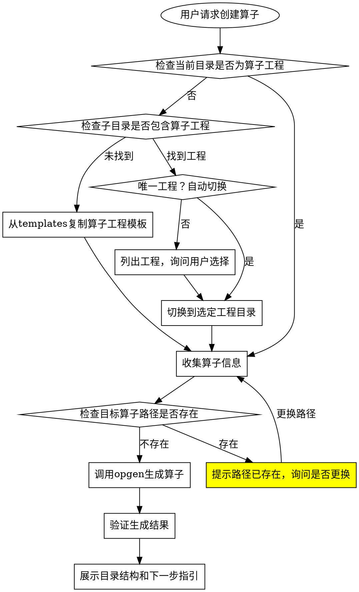

# AscendC 算子工程初始化

**Skill类型**：流程导向型（多阶段工作流，阶段检查点）

快速创建AscendC算子工程脚手架，所有算子都生成在ops目录下。

## 核心原则

1. **单一目录**：所有算子统一生成在`ops`目录下，不支持自定义类别
2. **安全优先**：自动检查目录是否存在，避免覆盖现有文件
3. **命名规范**：严格要求snake_case命名格式
4. **流程完整性**：从工程检测到算子生成的全流程自动化
5. **结果可验证**：提供清晰的目录结构和验证方法

## 工作流程



## 步骤1：检查并初始化算子工程环境

### 1.1 检测算子工程位置

**判断标准**：算子工程根目录必须包含以下文件：
- `build.sh`（编译脚本）
- `CMakeLists.txt`（CMake配置）
- 至少一个辅助目录：`ops/`、`examples/`或`scripts/`

**检测策略**：
1. 检查当前目录是否为算子工程根目录
2. 检查一级子目录是否包含算子工程
3. 检查常见的工程目录名称（ops-project, ascendc-development, project等）

**执行命令**：
```bash
bash <skill_dir>/scripts/detect_ops_project.sh
```

### 1.2 处理检测结果

| 情况 | 处理方式 |
|------|---------|
| 当前目录是算子工程 | 直接继续操作 |
| 子目录包含唯一工程 | 自动切换到该目录并提示用户 |
| 子目录包含多个工程 | 列出所有工程，让用户选择并切换 |
| 未检测到工程 | 提示用户需要初始化工程，询问复制模板的位置 |

### 1.3 初始化新工程（如果需要）

**复制模板命令**：
```bash
cp -r "<skill_dir>/templates/ops-project" .
```

## 反模式清单（NEVER DO THESE）

- ❌ 不要在非ops目录下生成算子
- ❌ 不要覆盖已存在的算子目录
- ❌ 不要使用除snake_case外的其他命名格式
- ❌ 不要修改模板中的核心文件结构
- ❌ 不要跳过目录存在性检查

## 步骤2：收集算子信息

**必须确认的信息**：

| 信息 | 格式要求 | 说明 |
|------|----------|------|
| 算子名称 | snake_case | 如 `rms_norm`, `flash_attn` |
| 算子类型 | 固定为 `ops` | 所有算子都生成在ops目录下 |

**调用skill**：收集完信息后，必须调用 `ascendc-operator-design` skill 进行算子设计

**确认模板**：
```
=== 算子工程信息 ===
算子名称: <op_name>
算子类型: ops
输出路径: ./ops/<op_name>

确认创建？[Y/n]
```

## 步骤3：检查前置条件

1. 确认在ops-project根目录下（build.sh存在）
2. 确认目标目录 `./ops/<op_name>` 不存在

## 步骤4：生成算子工程

**执行命令**：
```bash
bash build.sh --genop=ops/<op_name>
```

## 步骤5：验证生成结果

**检查生成的目录结构**：
```
./ops/<op_name>/
├── CMakeLists.txt              # 编译配置
├── op_host/                    # Host侧代码
│   ├── <op_name>_def.cpp       # 算子定义
│   ├── <op_name>_tiling.cpp    # Tiling实现
│   └── <op_name>_infershape.cpp # Shape推导
├── op_kernel/                  # AI Core侧代码
│   ├── <op_name>.cpp           # Kernel入口
│   └── <op_name>.h             # Kernel类定义
├── examples/                   # 示例代码
└── tests/                      # 测试代码
```

**调用skill**：生成成功后，必须调用以下skill完成后续开发：
1. 调用 `ascendc-operator-tiling-code-gen` skill 实现Host侧Tiling代码
2. 调用 `ascendc-operator-kernel-code-gen` skill 实现AI Core侧Kernel代码

## 步骤6：下一步指引

**提示用户**：
```
算子工程 <op_name> 创建成功！

下一步操作（必须使用指定skill完成）：
1. 完成算子设计：必须调用 ascendc-operator-design skill
2. 实现Tiling：必须调用 ascendc-operator-tiling-code-gen skill
3. 实现Kernel：必须调用 ascendc-operator-kernel-code-gen skill
4. 编译调试：必须调用 ascendc-operator-compile-debug skill
5. 框架适配（如需）：必须调用 ascendc-operator-frame-adapter-torch skill
6. 文档生成：必须调用 ascendc-operator-doc-gen skill
```

## 命名规范

| 类型 | 规范 | 示例 |
|------|------|------|
| 算子名称 | snake_case | `add_example`, `rms_norm` |
| 算子类名 | PascalCase | `AddExample`, `RmsNorm` |
| 命名空间 | Ns+PascalCase | `NsAddExample`, `NsRmsNorm` |
| 宏定义 | UPPER_CASE | `ADD_EXAMPLE`, `RMS_NORM` |

## 常见问题与解决方案

| 问题 | 解决方案 |
|------|---------|
| 目标目录已存在 | 更换算子名称或输出路径 |
| opgen脚本不存在 | 确认在ops-project根目录下执行，或先复制工程模板 |
| 权限不足 | 检查目录写入权限 |
| Python版本不兼容 | 使用Python 3.7+ |
| 模板复制失败 | 检查skill目录路径是否正确 |

## 注意事项

- 算子名称只能包含字母、数字和下划线
- 系统会自动检查目录是否存在，避免覆盖
- 生成的代码为模板骨架，需要根据算子设计进行填充
- 如果当前目录没有算子工程，系统会提示初始化
