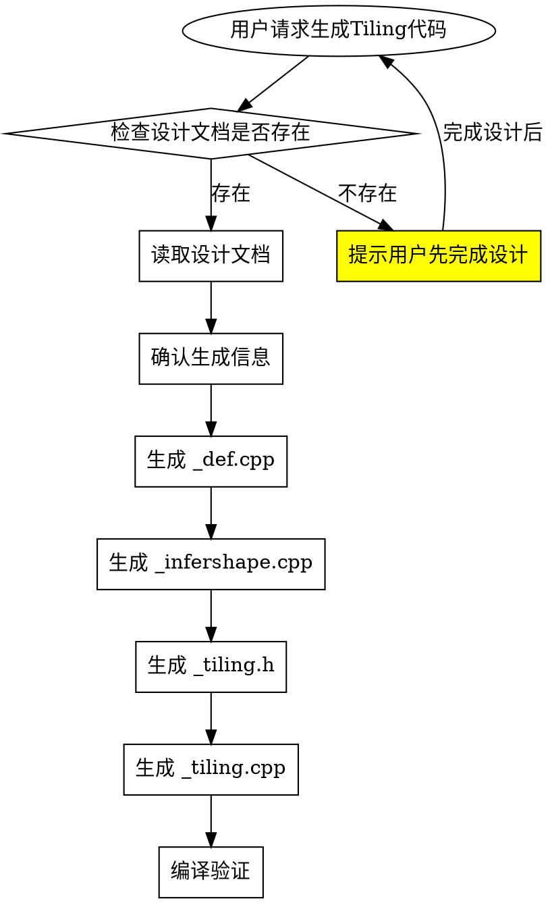

# AscendC 算子 Tiling 代码生成

根据算子设计文档生成op_host目录下的Host侧代码。

## 前置条件

**必须先完成算子设计**（使用 `ascendc-operator-design` skill），设计文档需包含：

1. **原型设计**：aclnn接口定义、输入输出参数
2. **规格约束**：数据类型、格式、shape限制
3. **Tiling切分策略**：核间切分、核内切分

## 工作流程



## 步骤1：确认设计信息

**从设计文档提取并向用户确认**：

```
=== 算子信息确认 ===
算子名称: <op_name>
输入参数:
  - x1: Tensor, dtype=[FLOAT16, FLOAT], format=ND
  - x2: Tensor, dtype=[FLOAT16, FLOAT], format=ND
输出参数:
  - y: Tensor, dtype=[FLOAT16, FLOAT], format=ND
支持的SoC: ascend910b, ascend950

Tiling策略:
  - 核间切分: 按totalLength均匀切分
  - 核内切分: 根据UB大小计算ubFactor
  - TilingKey: 按dtype区分

确认生成？[Y/n]
```

## 步骤2：生成 _def.cpp（算子定义）

**文件路径**：`op_host/<op_name>_def.cpp`

```cpp
/**
 * Copyright (c) 2025 Huawei Technologies Co., Ltd.
 * ...
 */

#include "register/op_def_registry.h"

namespace ops {
class <OpName> : public OpDef {
public:
    explicit <OpName>(const char* name) : OpDef(name)
    {
        // === 输入定义（列出所有一一对应的组合）===
        this->Input("x1")
            .ParamType(REQUIRED)
            .DataType({ge::DT_FLOAT, ge::DT_FLOAT16})
            .Format({ge::FORMAT_ND, ge::FORMAT_ND})
            .UnknownShapeFormat({ge::FORMAT_ND, ge::FORMAT_ND})
            .AutoContiguous();

        this->Input("x2")
            .ParamType(REQUIRED)
            .DataType({ge::DT_FLOAT, ge::DT_FLOAT16})
            .Format({ge::FORMAT_ND, ge::FORMAT_ND})
            .UnknownShapeFormat({ge::FORMAT_ND, ge::FORMAT_ND})
            .AutoContiguous();

        this->Output("y")
            .ParamType(REQUIRED)
            .DataType({ge::DT_FLOAT, ge::DT_FLOAT16})
            .Format({ge::FORMAT_ND, ge::FORMAT_ND})
            .UnknownShapeFormat({ge::FORMAT_ND, ge::FORMAT_ND})
            .AutoContiguous();

        // === 属性定义（可选）===
        this->Attr("reduceDim")
            .AttrType(REQUIRED)
            .Int();
        this->Attr("isKeepDim")
            .AttrType(OPTIONAL)
            .Int(1);  // 默认值

        // === SoC配置 ===
        this->AICore().AddConfig("ascend910b");
        this->AICore().AddConfig("ascend910_93");

        // === 多硬件平台差异化注册（可选）===
        // OpAICoreConfig config;
        // config.Input("x1")
        //     .ParamType(REQUIRED)
        //     .DataType({ge::DT_FLOAT, ge::DT_BF16})
        //     .Format({ge::FORMAT_ND, ge::FORMAT_ND});
        // this->AICore().AddConfig("ascend910b", config);
    }
};
OP_ADD(<OpName>);
} // namespace ops
```

**生成要点**：
- **输入输出定义**：根据设计文档的输入输出参数填充
- **DataType和Format**：需要一一对应，数量一致
- **属性定义**：REQUIRED（必选）或OPTIONAL（可选，可设置默认值）
- **多硬件平台**：通过OpAICoreConfig注册差异化原型，覆盖OpDef中的定义

## 步骤3：生成 _infershape.cpp（Shape推导）

**文件路径**：`op_host/<op_name>_infershape.cpp`

```cpp
/**
 * Copyright (c) 2025 Huawei Technologies Co., Ltd.
 * ...
 */

#include "register/op_impl_registry.h"
#include "log/log.h"

namespace ops {

static constexpr int64_t IDX_0 = 0;

static ge::graphStatus InferShape<OpName>(gert::InferShapeContext* context)
{
    OP_LOGD(context->GetNodeName(), "Begin to do InferShape<OpName>");

    // 获取输入shape
    const gert::Shape* xShape = context->GetInputShape(IDX_0);
    OP_CHECK_NULL_WITH_CONTEXT(context, xShape);

    // 获取输出shape
    gert::Shape* yShape = context->GetOutputShape(IDX_0);
    OP_CHECK_NULL_WITH_CONTEXT(context, yShape);

    // 设置输出shape（根据算子逻辑）
    auto xShapeSize = xShape->GetDimNum();
    yShape->SetDimNum(xShapeSize);
    for (size_t i = 0; i < xShapeSize; i++) {
        yShape->SetDim(i, xShape->GetDim(i));
    }

    OP_LOGD(context->GetNodeName(), "End to do InferShape<OpName>");
    return GRAPH_SUCCESS;
}

IMPL_OP_INFERSHAPE(<OpName>).InferShape(InferShape<OpName>);

} // namespace ops
```

**常见Shape推导模式**：

| 算子类型 | 推导规则 |
|---------|---------|
| 元素级 | 输出shape = 输入shape |
| 归约 | 输出shape = 输入shape移除归约维度 |
| 矩阵乘法 | 输出shape = [..., M, N] |
| 池化 | 根据kernel_size/stride计算 |

## 步骤4：生成 _tiling.h（Tiling数据结构定义）

**文件路径**：`op_host/<op_name>_tiling.h`

### 方式1：单结构定义（平铺形式）

```cpp
#ifndef __<OP_NAME>_TILING_H__
#define __<OP_NAME>_TILING_H__

#include "register/tilingdata_base.h"

namespace optiling {
BEGIN_TILING_DATA_DEF(<OpName>TilingData)
    TILING_DATA_FIELD_DEF(uint64_t, totalLength);       // 总计算数据量
    TILING_DATA_FIELD_DEF(uint32_t, formerNum);         // 整核核数（计算量较多的核）
    TILING_DATA_FIELD_DEF(uint32_t, formerLength);      // 整核计算的数据长度
    TILING_DATA_FIELD_DEF(uint32_t, tailNum);           // 尾核核数（计算量较少的核）
    TILING_DATA_FIELD_DEF(uint32_t, tailLength);        // 尾核计算的数据长度
END_TILING_DATA_DEF;

REGISTER_TILING_DATA_CLASS(<OpName>, <OpName>TilingData)
} // namespace optiling

#endif // __<OP_NAME>_TILING_H__
```

### Tiling结构体成员说明

当数据无法均分到所有核时，需要区分整核和尾核：

| 成员 | 类型 | 说明 |
|------|------|------|
| `formerNum` | uint32_t | 整核核数（分配到数据量较多的核数） |
| `tailNum` | uint32_t | 尾核核数（分配到数据量较少的核数） |
| `formerLength` | uint32_t | 整核计算的数据长度（向上32字节对齐） |
| `tailLength` | uint32_t | 尾核计算的数据长度（向下32字节对齐） |

### 方式2：结构体嵌套（适用于复杂场景）

```cpp
#ifndef __<OP_NAME>_TILING_H__
#define __<OP_NAME>_TILING_H__

#include "register/tilingdata_base.h"

namespace optiling {
// 定义子结构1
BEGIN_TILING_DATA_DEF(MyStruct1)
    TILING_DATA_FIELD_DEF(uint64_t, field1);
    TILING_DATA_FIELD_DEF(uint64_t, field2);
END_TILING_DATA_DEF;
REGISTER_TILING_DATA_CLASS(MyStruct1Op, MyStruct1)

// 定义子结构2
BEGIN_TILING_DATA_DEF(MyStruct2)
    TILING_DATA_FIELD_DEF(uint64_t, field3);
    TILING_DATA_FIELD_DEF(uint64_t, field4);
END_TILING_DATA_DEF;
REGISTER_TILING_DATA_CLASS(MyStruct2Op, MyStruct2)

// 主结构嵌套子结构
BEGIN_TILING_DATA_DEF(<OpName>TilingData)
    TILING_DATA_FIELD_DEF_STRUCT(MyStruct1, st1);
    TILING_DATA_FIELD_DEF_STRUCT(MyStruct2, st2);
END_TILING_DATA_DEF;
REGISTER_TILING_DATA_CLASS(<OpName>, <OpName>TilingData)
} // namespace optiling

#endif // __<OP_NAME>_TILING_H__
```

**赋值方式**：
```cpp
// 单结构
<OpName>TilingData tiling;
tiling.set_totalLength(totalLength);

// 嵌套结构
<OpName>TilingData tiling;
tiling.st1.set_field1(1);
tiling.st1.set_field2(2);
tiling.st2.set_field3(3);
```

## 步骤5：生成 _tiling.cpp（Tiling实现）

**文件路径**：`op_host/<op_name>_tiling.cpp`

```cpp
/**
 * Copyright (c) 2025 Huawei Technologies Co., Ltd.
 * ...
 */

#include "tiling/platform/platform_ascendc.h"
#include "log/log.h"
#include "util/math_util.h"
#include "op_host/tiling_util.h"
#include "op_host/tiling_templates_registry.h"
#include "<op_name>_tiling.h"

namespace optiling {

// === 常量定义 ===
constexpr int64_t BUFFER_NUM = 6;      // 双缓冲时的缓冲区数量
constexpr int64_t TYPE_SIZE = 4;       // 数据类型大小
constexpr uint32_t BLOCK_SIZE = 32;    // 32字节对齐要求
constexpr uint32_t ALIGN_NUM = BLOCK_SIZE / TYPE_SIZE;  // 对齐元素个数

// === tilingKey定义 ===
constexpr int32_t TILING_KEY_EXAMPLE_FLOAT = 0;
constexpr int32_t TILING_KEY_EXAMPLE_FLOAT16 = 1,

struct <OpName>CompileInfo {};

// === 获取平台信息 ===
static ge::graphStatus GetPlatformInfo(gert::TilingContext* context,
                                       uint64_t& ubSize, int64_t& coreNum, uint64_t& sysWorkspaceSize)
{
    auto platformInfoPtr = context->GetPlatformInfo();
    OP_CHECK_NULL_WITH_CONTEXT(context, platformInfoPtr);
    auto ascendcPlatform = platform_ascendc::PlatformAscendC(platformInfoPtr);
    coreNum = ascendcPlatform.GetCoreNumAiv();
    OP_CHECK_IF(coreNum == 0, OP_LOGE(context, "coreNum is 0"), return ge::GRAPH_FAILED);
    ascendcPlatform.GetCoreMemSize(platform_ascendc::CoreMemType::UB, ubSize);
    OP_CHECK_IF(ubSize == 0, OP_LOGE(context, "ubSize is 0"), return ge::GRAPH_FAILED);
    sysWorkspaceSize = ascendcPlatform.GetLibApiWorkSpaceSize();
    return ge::GRAPH_SUCCESS;
}

// === 获取Shape和属性信息 ===
static ge::graphStatus GetShapeAttrsInfo(gert::TilingContext* context,
                                         int64_t& totalIdx, ge::DataType& dataType)
{
    // 获取输入shape
    auto inputX = context->GetInputShape(0);
    OP_CHECK_NULL_WITH_CONTEXT(context, inputX);
    auto inputShape = inputX->GetStorageShape();

    // 计算总元素数
    totalIdx = inputShape.GetShapeSize();

    // 获取数据类型
    auto inputDesc = context->GetInputDesc(0);
    OP_CHECK_NULL_WITH_CONTEXT(context, inputDesc);
    dataType = inputDesc->GetDataType();

    // 数据类型校验
    const std::set<ge::DataType> supportedDtype = {ge::DT_FLOAT, ge::DT_FLOAT16};
    if (supportedDtype.count(dataType) == 0) {
        OP_LOGE(context, "unsupported dtype: %d", static_cast<int>(dataType));
        return ge::GRAPH_FAILED;
    }
    return ge::GRAPH_SUCCESS;
}

// === Tiling主函数 ===

static ge::graphStatus <OpName>TilingFunc(gert::TilingContext* context)
{
    // 1. 获取平台信息
    uint64_t ubSize;
    int64_t coreNum;
    int64_t sysWorkspaceSize;
    OP_CHECK_IF(GetPlatformInfo(context, ubSize, coreNum, sysWorkspaceSize) != ge::GRAPH_SUCCESS,
                OP_LOGE(context, "GetPlatformInfo error"), return ge::GRAPH_FAILED);

    // 2. 获取Shape和属性
    int64_t totalIdx;
    ge::DataType dataType;
    OP_CHECK_IF(GetShapeAttrsInfo(context, totalIdx, dataType) != ge::GRAPH_SUCCESS,
                OP_LOGE(context, "GetShapeAttrsInfo error"), return ge::GRAPH_FAILED);

    // 3. 计算尾核切分参数
    uint32_t totalLength = static_cast<uint32_t>(totalIdx);
    uint32_t alignNum = BLOCK_SIZE / TYPE_SIZE;  // 32字节对齐的元素个数

    // 数据向上对齐到32字节
    // 假设原totalLength为1999，向上满足32字节对齐后为2000
    uint32_t totalLengthAligned = ((totalLength + alignNum - 1) / alignNum) * alignNum;

    // 核心数为8，一个datablock包含16个数，那么：datablock的总数：2000 / 16 = 125
    // 有5个核会分到16个datablock：125 % 8 = 5，可以称之为整核
    // 有3个核会分到15个datablock：8 - 5 = 3，可以称之为尾核
    uint32_t formerNum = (totalLengthAligned / alignNum) % coreNum;
    uint32_t tailNum = coreNum - formerNum;

    // 整核计算的数据长度：向上32字节对齐
    uint32_t formerLength = ((totalLengthAligned / coreNum + alignNum - 1) / alignNum) * alignNum;
    // 尾核计算的数据长度：向下32字节对齐
    uint32_t tailLength = (totalLengthAligned / coreNum / alignNum) * alignNum;

    // 4. 填充Tiling数据
    <OpName>TilingData tiling;
    tiling.set_totalLength(totalLengthAligned);
    tiling.set_formerNum(formerNum);
    tiling.set_formerLength(formerLength);
    tiling.set_tailNum(tailNum);
    tiling.set_tailLength(tailLength);

    // 5. 设置TilingKey和BlockDim
    context->SetBlockDim(coreNum);
    uint64_t tilingKey = 0;
    if (dataType == ge::DT_FLOAT) {
        tilingKey = TILING_KEY_EXAMPLE_FLOAT;
    } else if (dataType == ge::DT_FLOAT16) {
        tilingKey = TILING_KEY_EXAMPLE_FLOAT16;
    }
    context->SetTilingKey(tilingKey);

    // 6. TilingData序列化
    tiling.SaveToBuffer(context->GetRawTilingData()->GetData(),
                        context->GetRawTilingData()->GetCapacity());
    context->GetRawTilingData()->SetDataSize(tiling.GetDataSize());

    // 7. 设置Workspace
    size_t* currentWorkspace = context->GetWorkspaceSizes(1);
    OP_CHECK_NULL_WITH_CONTEXT(context, currentWorkspace);
    currentWorkspace[0] = sysWorkspaceSize;

    return ge::GRAPH_SUCCESS;
}

// === TilingParse（可选） ===
static ge::graphStatus TilingParseFor<OpName>([[maybe_unused]] gert::TilingParseContext* context)
{
    return ge::GRAPH_SUCCESS;
}

// === 注册 ===
IMPL_OP_OPTILING(<OpName>).Tiling(<OpName>TilingFunc).TilingParse<<OpName>CompileInfo>(TilingParseFor<OpName>);

} // namespace optiling
```

**生成要点**：
- 根据算子类型选择合适的切分策略
- 元素级算子：按总元素数均匀切分
- 归约类算子：需要层次归约策略
- 矩阵乘法：按M/N维度切分

## 编译验证

生成代码后执行编译验证：

```bash
# 编译host代码
bash build.sh --ophost --soc=ascend910b --ops=<op_name>

# 运行UT测试
bash build.sh -u --ophost --ops=<op_name>
```

## 常见问题

| 问题 | 原因 | 解决方案 |
|------|------|---------|
| `undefined reference` | 头文件路径错误 | 检查include路径 |
| `tiling data mismatch` | TilingData结构不匹配 | 同步_tiling_data.h |
| `coreNum is 0` | 平台信息获取失败 | 检查SoC配置 |

## 注意事项

1. **类型一致性**：_def.cpp中的DataType要与_tiling.cpp中的校验一致
2. **内存对齐**：ubFactor需要按32字节对齐
3. **TilingKey**：确保Kernel侧使用相同的Key值
4. **Workspace**：如果需要临时内存，在GetWorkspaceSize中设置
