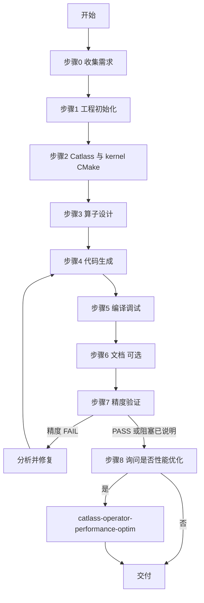

# Catlass 算子端到端开发编排

## 核心工作流



## 核心原则

1. **端到端连续执行（硬约束）**：Agent **必须亲自**完成可执行步骤链条，**禁止**用「建议您执行…」替代。仅当环境确实无法执行时，说明原因后列出待执行命令。
2. **按 Skill 执行**：每个阶段须**打开并遵循对应子 Skill**，禁止只口头点名而不照做。
3. **算子命名**：`op_name`（snake_case）**必须**包含子串 `catlass`。
4. **诚实停机**：因环境或数据无法继续时，说明**具体原因**与**已完成步骤**后停止，不编造报告。
5. **AscendC skill 与 Catlass skill 的优先级**：在开发 **Catlass 算子**（`op_name` 含 `catlass`、走本编排）时，若某环节同时存在通用 **ascendc-*** skill 与 **catlass-*** skill（如设计、代码生成、kernel 规则），**优先打开并遵循 catlass-*** 系列；**不要**用 ascendc 的通用 tiling/kernel 文档替代 `catlass-operator-design` / `catlass-operator-code-gen` 的交付约定。编译、安装、跑 `test_aclnn` 仍用 **ascendc-operator-compile-debug**（无 catlass 专用替代时保持不变）。

## 工程目录术语

| 术语 | 含义 |
|------|------|
| **OPS_PROJECT_ROOT** | 含 `build.sh`、`ops/` 的工程根；catlass 默认位于 `<OPS_PROJECT_ROOT>/catlass/` |
| **USER_OP_PROJECT** | 单算子目录 `<OPS_PROJECT_ROOT>/ops/<算子名>/` |

**约束（仅允许改算子目录时）**：若不能修改工程根、不能在 `<OPS_PROJECT_ROOT>/catlass` 克隆，可将 Catlass 放在 **`USER_OP_PROJECT/third_party/catlass`**，并在该算子的 `op_kernel/CMakeLists.txt` 中用 `get_filename_component(CATLASS_DIR "${CMAKE_CURRENT_SOURCE_DIR}/../third_party/catlass" ABSOLUTE)` 配置 `-I`；步骤 2 中「工程根克隆」改为在该算子目录内维护一份 catlass 源码树即可。

## 入口判断

| 用户意图 | 处理方式 |
|----------|----------|
| 从零开发新算子 | 从步骤 0 起顺序执行 |
| 已有工程，仅缺某阶段 | 从最近未完成阶段开始 |
| 仅询问流程或状态 | 展示「状态跟踪」对应行 |

## 编排反模式

- ❌ 跳过工程初始化或 catlass 引入就进入设计/代码生成
- ❌ 新建算子使用不含 `catlass` 的 `op_name`
- ❌ 仅把实现留在 catlass 示例树内，不写入 USER_OP_PROJECT
- ❌ 以「建议用户自行…」代替 Agent 实际执行
- ❌ 精度验证未跑完却声称完成，或 FAIL 后只汇报不分析

## 步骤编排

### 步骤 0：收集需求

本编排器直接执行，不调用子 skill。

确认：`op_name`（须含 catlass）、功能要点、CANN/SoC 环境。

### 步骤 1：工程初始化

**子技能**：`ascendc-operator-project-init`

**无工程时的动作（须执行，禁止只提示用户）**：在拟定的 `OPS_PROJECT_ROOT` 目录若检测不到 `build.sh` + `CMakeLists.txt` + `ops/`（或 `detect_ops_project.sh` 返回 `PROJECT_NOT_FOUND`），则按 `ascendc-operator-project-init` **步骤 1.3** 从该 skill 的 `templates/ops-project` 复制模板到用户确认或 Agent 与用户约定的路径，再在该根目录执行后续 `build.sh --genop`。

**与 project-init 步骤 5/6 的衔接（CRITICAL）**：Catlass 端到端下，完成 `--genop` 后**不得**按 project-init 的默认文案强制进入 `ascendc-operator-tiling-code-gen` / `ascendc-operator-kernel-code-gen`；应直接进入本编排的 **步骤 2**（Catlass 与 kernel CMake）→ **步骤 3**（`catlass-operator-design`）→ **步骤 4**（`catlass-operator-code-gen`）。详见 `ascendc-operator-project-init` 中「与 Catlass 端到端编排的衔接」表。

**产出**：`OPS_PROJECT_ROOT` 与 `USER_OP_PROJECT` 已明确。

### 步骤 2：准备 Catlass 源码与 kernel 编译选项

**前置**：步骤 1 完成；`cd <OPS_PROJECT_ROOT>`，确认存在 `build.sh` 与 `ops/`。

1. **源码树**：若尚无 `catlass/include`、`catlass/examples`，执行  
   `git clone https://gitcode.com/cann/catlass.git catlass`  
   **仅**在工程根执行，**禁止**在 `USER_OP_PROJECT` 内克隆。

2. **让 kernel 能编进 catlass**：对每个要写 Catlass kernel 的算子，若 `ops/<op_name>/op_kernel/CMakeLists.txt` 缺失或不含 catlass 选项，按 **catlass-operator-code-gen → references/kernel-rules.md**「Catlass 源码与 kernel 编译」补全（`opgen` 常不生成该文件）。

参考`catlass/README.md`中aclnn工程添加编译选项的方式，在`op_kernel/CMakeLists.txt`中添加编译选项。

**产出**：`<OPS_PROJECT_ROOT>/catlass/` 可浏览；目标算子的 `op_kernel/CMakeLists.txt` 已能把 `-I.../catlass/include` 与 `CATLASS_ARCH` 交给构建系统。

### 步骤 3：算子设计

**子技能**：`catlass-operator-design`

**前置**：步骤 2 完成，catlass 仓库可访问。

**产出**：设计文档已定稿（路径明确）。

### 步骤 4：代码生成

**子技能**：`catlass-operator-code-gen`

**前置**：步骤 3 的设计文档。

**产出**：USER_OP_PROJECT 内含 op_host、op_kernel、`examples/test_aclnn_<op_name>.cpp`。

### 步骤 5：编译调试

**子技能**：`ascendc-operator-compile-debug`

**前置**：步骤 4 的代码已落地。

**产出**：编译通过；具备运行条件时执行示例并记录输出。

### 步骤 6：文档生成（可选）

**子技能**：`ascendc-operator-doc-gen`

用户可跳过。安排在编译之后、精度之前。

### 步骤 7：精度验证

**子技能**：`ascendc-operator-precision-eval`

**前置**：`test_aclnn_<op_name>.cpp` 存在，步骤 5 至少已可编译。

**产出**：PASS / FAIL / 阻塞说明。

**FAIL 闭环**：分析原因 → 修正设计或代码 → 回到步骤 5 → 步骤 6 → 步骤 7 复测。

### 步骤 8：询问是否性能优化

**须主动向用户提问**，不得默认跳过。

- 同意 → 调用 `catlass-operator-performance-optim`，涉及代码变更时回到步骤 5→6→7 迭代
- 拒绝 → 结束主流程

## 状态跟踪

| 阶段 | 检查点 |
|------|--------|
| 工程初始化 | `OPS_PROJECT_ROOT` 下存在 `ops/<op_name>/` |
| Catlass 就绪 | `<OPS_PROJECT_ROOT>/catlass/` 可引用；目标算子 `op_kernel/CMakeLists.txt` 已配置 |
| 设计文档 | 已定稿且路径明确 |
| 代码生成 | USER_OP_PROJECT 含 host/kernel 与 test_aclnn |
| 编译调试 | 编译通过；运行按环境执行 |
| 文档 | 已生成或用户跳过 |
| 精度验证 | PASS / FAIL / 阻塞 |
| 性能调优 | 已询问用户；已执行或已跳过 |

## 子技能调用顺序

```
catlass-operator-dev（本编排器）
    │
    ├── 1. ascendc-operator-project-init
    ├── 2. （本 skill 步骤 2：clone catlass + op_kernel CMake，见 kernel-rules）
    ├── 3. catlass-operator-design
    ├── 4. catlass-operator-code-gen
    ├── 5. ascendc-operator-compile-debug
    ├── 6. ascendc-operator-doc-gen（可选）
    ├── 7. ascendc-operator-precision-eval
    │         └──（FAIL）回到 4 或 3 → 5 → 6 → 7
    └── 8. catlass-operator-performance-optim（用户同意时）
              └── 代码变更时回到 5 → 6 → 7
```
